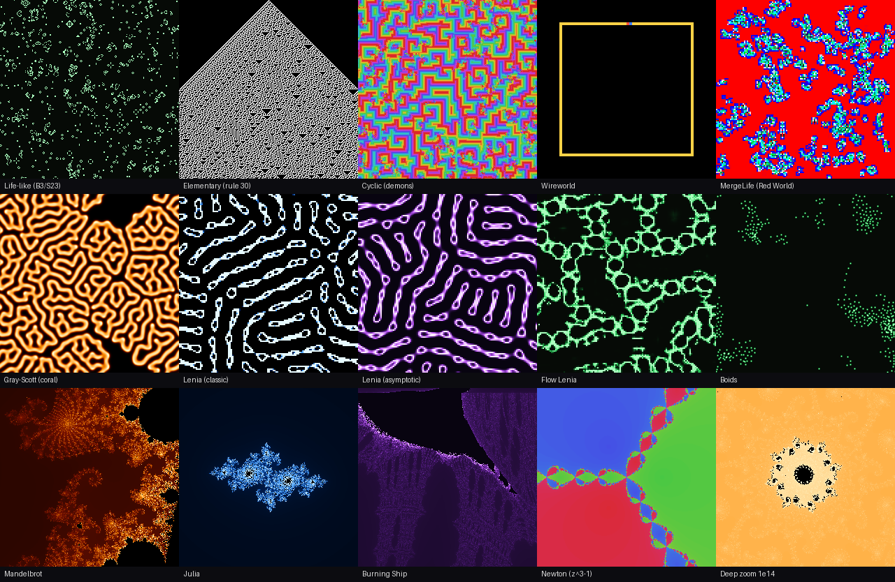

  

# heaton-life

*One tile per system, rendered by the library itself. Bottom right: the Mandelbrot set at a zoom of 10¹⁴.*

heaton-life is a library for exploring **emergence**: simple rules that give rise to
complex, organic-looking behavior. It brings the classic systems of artificial life
together in one place, with one consistent way to set them up, step them, and render
them:

| Family | Systems |
|---|---|
| Cellular automata | MergeLife, Life-like (Conway's Life and every other B/S rule), Elementary, Cyclic, Wireworld |
| Lenia | Classic, Asymptotic, Flow |
| Fractals | Mandelbrot, Julia, Burning Ship, Newton, with perturbation deep zoom far beyond float64 |
| Boids | Reynolds flocking in 2D and 3D |
| Reaction-diffusion | Gray-Scott |

It also includes a genetic algorithm that evolves new MergeLife rules, and a
rendering pipeline that turns any system into still images and, in Python, animated
GIFs or MP4s.

What makes heaton-life different is that it is **specification first**. Every system
is defined by a language-neutral spec and pinned by a set of conformance vectors, and
two independent implementations, Python and .NET, are held to the same vectors. The
same parameters and seed give the same run in either language, which makes results
reproducible and lets the implementations check each other.

## Get the library

- **Python** (3.11+): `pip install heaton-life`. See the [Python README](python/README.md)
  for the API and a quick start, or open the
  [intro notebook](https://colab.research.google.com/github/jeffheaton/heaton-life/blob/main/python/examples/heaton_life_intro.ipynb)
  in Colab (also [viewable on GitHub](python/examples/heaton_life_intro.ipynb)). Includes
  an optional PyQt6 playground for exploring interactively.
- **.NET**: `dotnet add package HeatonLife.Core`, a dependency-free `netstandard2.1`
  assembly that runs anywhere .NET does, including Unity and IL2CPP. See the
  [.NET README](dotnet/README.md) for the API and a quick start.

## Apps

**Heaton Life** is a free app built on this library: every system above, on your
phone, tablet, or desktop. It is the easiest way to play with these systems, and my own MergeLife cellular automation.

### Get Heaton Life
- [Apple Store - macOS/iPhone/iPad](https://apps.apple.com/us/app/heaton-life/id6804346957)
- [Microsoft Store - Windows 10/11](https://apps.microsoft.com/detail/9NS1693PBPVN)
- Google Play - Android: coming soon

## Repository layout

| Path | Contents |
|---|---|
| [`spec/`](spec/) | Language-neutral algorithm specifications, the source of truth every implementation conforms to |
| [`vectors/`](vectors/) | Golden conformance vectors (parameters plus expected states) shared by all implementations |
| [`python/`](python/) | Python implementation (NumPy), the playground, the intro notebook, and the [development guide](python/DEVELOPMENT.md) |
| [`dotnet/`](dotnet/) | C#/.NET implementation (netstandard2.1 core, full parity with Python) and its [development guide](dotnet/DEVELOPMENT.md) |
| [`docs/`](docs/) | The README gallery image (regenerated by `python/tools/gen_gallery.py`) and the package icon |
| [`.github/workflows/`](.github/workflows/) | The manually dispatched build, PyPI deploy, and NuGet publish workflows |
| [`ROADMAP.md`](ROADMAP.md) | Phased implementation plan and what is still future work |

## Design principles

- **Spec first.** Each family is defined by its math (gather, respond, integrate), its
  parameters, and its conformance vectors, never by an implementation's idioms.
- **Deterministic replay.** Parameters and a seed fully determine a run. The random
  number generator (PCG32) is pinned in the spec, and the discrete automata are
  specified in integer math so every language produces identical states.
- **Params in, frames out.** Every system produces array frames; one rendering
  pipeline serves all families.
- **Precision is a contract, not a retrofit.** Fractal viewports carry
  arbitrary-precision centers from day one (see [`spec/deep-zoom.md`](spec/deep-zoom.md)).

## Status

Both packages are released ([heaton-life on PyPI](https://pypi.org/project/heaton-life/),
[HeatonLife.Core on NuGet](https://www.nuget.org/packages/HeatonLife.Core/)). Every
family above is implemented in Python with specs, conformance vectors, and
playground support. The .NET port has full library parity: every family, the
colormap pipeline, and the MergeLife evolver replay the shared vectors (bit-exact
tiers exactly, epsilon tiers within tolerance; MergeLife is byte-identical with the
upstream engines). See [ROADMAP.md](ROADMAP.md).

## Contributing and bug reports

Bug reports and questions go to the [issue tracker](https://github.com/jeffheaton/heaton-life/issues);
please include the family, the parameters and seed, and which package and version
(`heaton_life.__version__` or `HeatonLifeVersion.Version`).

Contributions are welcome. The rule that shapes every change is that the [spec](spec/)
wins and the [vectors](vectors/) decide: a behavior change lands as a spec update, then
the Python implementation (plus additive vectors), then the .NET port, with both test
suites green, and existing vectors are never regenerated without a spec-change
justification. The [Python](python/DEVELOPMENT.md) and [.NET](dotnet/DEVELOPMENT.md)
development guides cover setup, the checks CI runs, adding a family, and the release
workflows.

## License

Copyright 2026 Jeff Heaton. Licensed under the [Apache License, Version 2.0](LICENSE).
