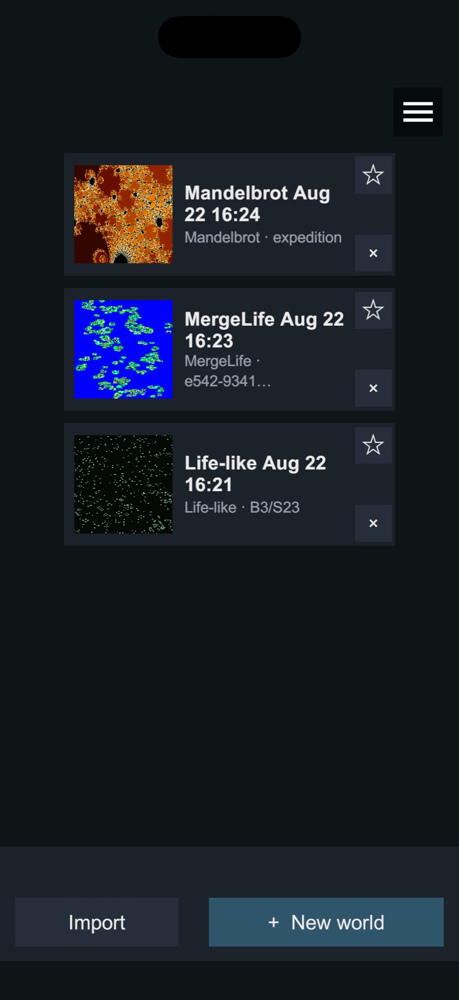
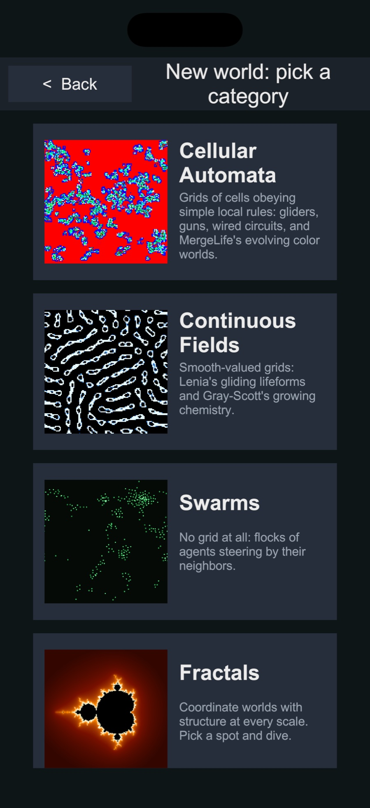
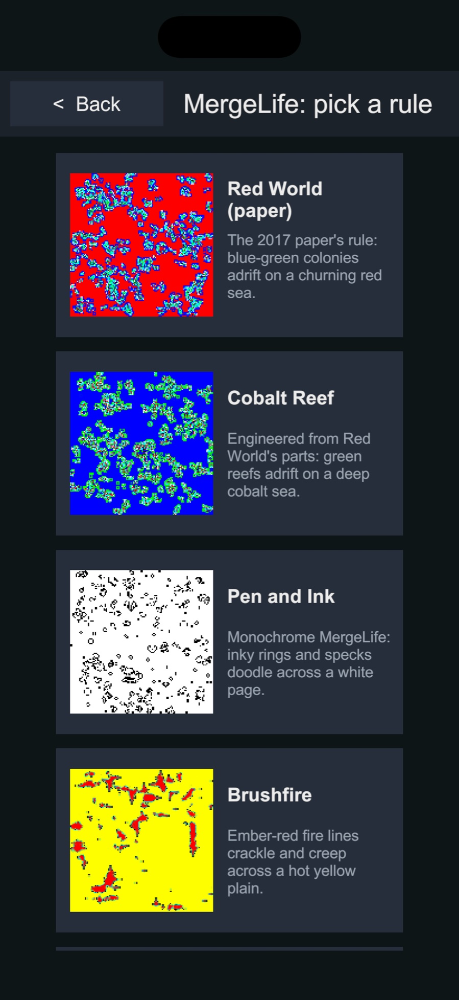
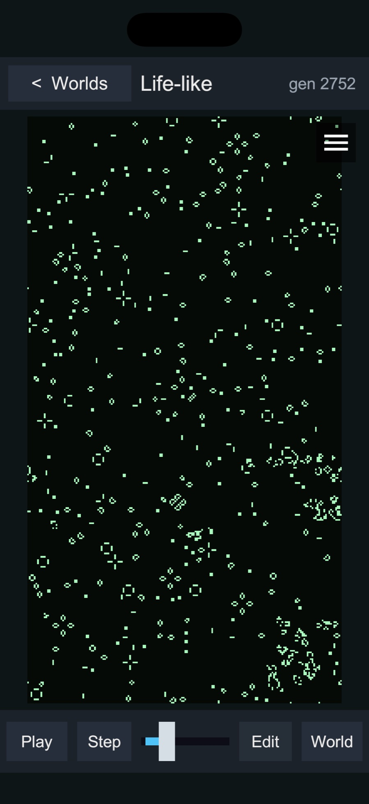
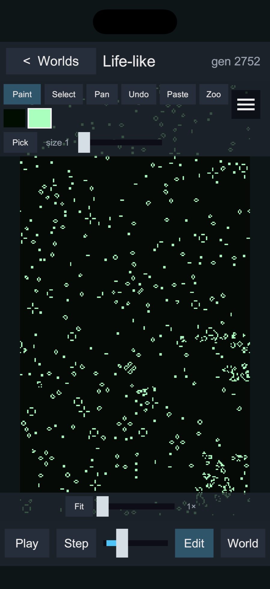
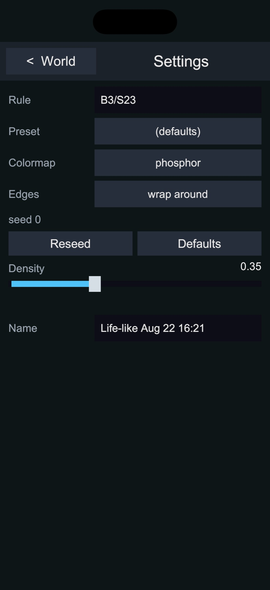
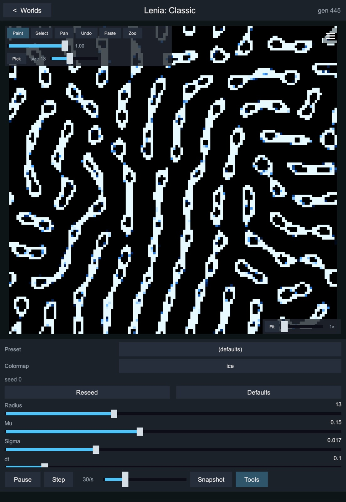
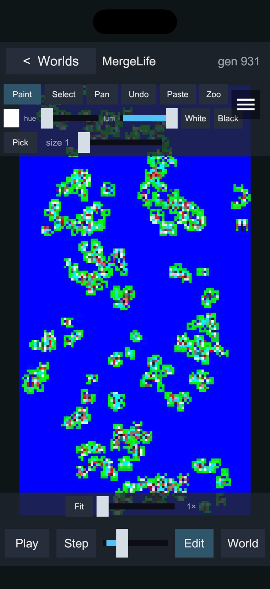
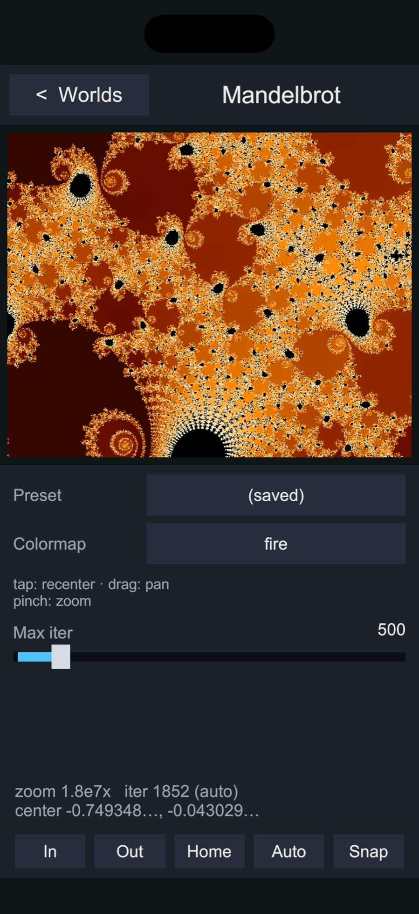
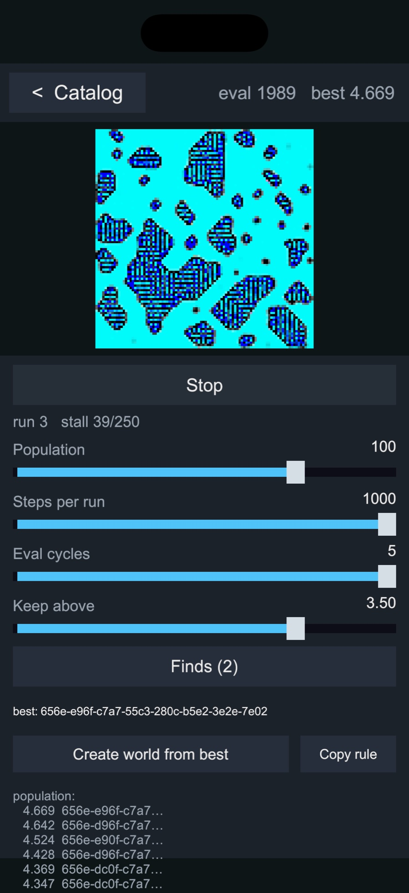

# Heaton Life User Guide — iPhone, iPad & Android

Heaton Life is an app for exploring **emergence** — simple rules that grow complex, organic-looking behavior. It brings the classic systems of artificial life together in one place: cellular automata (MergeLife, Conway-style Life, Elementary, Cyclic, Wireworld), three flavors of Lenia, Gray-Scott reaction-diffusion, flocking boids, and deep-zoom fractals (Mandelbrot, Julia, Burning Ship, Newton). Create worlds, paint and edit them with pattern tools, breed brand-new MergeLife rules with the built-in evolver, and keep everything in your worlds library.

Everything runs and stays on your device — nothing is uploaded anywhere (see the [privacy policy](privacy.md)).

There is a separate guide for [Windows and macOS](manual-app.md).

---

## Families, Rules, and Worlds

- A **family** is a form of physics — MergeLife, Life-like, Wireworld, Classic Lenia, and so on. Each family is one tile in the New-world picker.
- A **rule** is the set of constants inside a family: a Life-like rulestring such as `B3/S23`, a MergeLife rule code, a Cyclic state count. The same family with a different rule is a parallel universe — a pattern moved between rules usually dies within a step, and finding the ones that survive is half the fun.
- A **world** is one live instance of a rule: its parameters, its starting seed, its current state, and its generation. It stays the same world through running, pausing, editing, and reloading.

Families of rules create worlds. A world's family is fixed for its lifetime; the rule can change inside it.

## Getting Started

When you open Heaton Life, you'll see your **worlds library** — a card for every world you've created, each with a live thumbnail, its name, and its family, rule, and generation. The first time you launch the app this screen says **No worlds yet**.

- **+ New world** — Opens the picker (next section).
- **Import** — Opens your device's file picker to import a pattern file (see [Importing Patterns](#importing-patterns)).
- The **MENU** button opens **Evolve MergeLife**, this **Heaton Life Manual**, and the **About** screen (version, build time, and the simulation library build the app is running — include these if you report a problem).

On each card, **★** marks a favorite and **×** deletes the world after a confirmation. There is no undo for a delete.

## Creating a World

**+ New world** opens the picker: four categories, each card fronted by a live preview — **Cellular Automata** (MergeLife, Life-like, Elementary, Cyclic, Wireworld), **Continuous Fields** (Classic, Asymptotic, and Flow Lenia, plus Gray-Scott), **Swarms** (Reynolds boids), and **Fractals** (Mandelbrot, Julia, Burning Ship, Newton). Tap a category, then a family. MergeLife goes one step further: its card opens the **rule gallery** of featured rules, each running live, and you pick the one to start from.

 

| Family | What you get |
|---|---|
| **MergeLife** | Colorful cellular automata where every rule is a hex code; the gallery's featured rules are a starting point, and the [evolver](#evolving-mergelife-rules) breeds new ones. |
| **Life-like** | Conway's Game of Life and its relatives — rulestrings like `B3/S23`. |
| **Elementary** | Wolfram's one-dimensional rules 0–255, drawn one row per generation. |
| **Cyclic** | N states that each consume the one before them — spirals and demons. |
| **Wireworld** | Electrons on wires: Empty, Head, Tail, and Conductor cells. |
| **Classic / Asymptotic / Flow** | Lenia — continuous Life with gliding lifeforms. |
| **Gray-Scott** | Reaction-diffusion chemistry: spots, stripes, dividing blobs. |
| **Reynolds** | Boids — flocking agents with no grid at all. |

Worlds are **born saved**: a new world joins your library immediately, is saved whenever you go back, and again when you leave the app. There is no Save button. New worlds are cut to the shape of your screen, so a phone world is tall and an iPad world matches its orientation.

## The World Screen

### On a phone

The world fills the screen from the top bar to the transport bar. **< Worlds** in the top-left returns to the library; the generation shows in the top-right.

 

The transport bar holds **Play / Pause**, **Step** (one generation), the **speed** slider (generations per second), **Edit**, and **World**:

- **Edit** shows and hides the editing tools. Phones open in viewing mode, so the canvas is clear until you ask for the tools.
- **World** opens the world's settings page: the **Rule** field (MergeLife and Life-like — type a rule and tap Done; an invalid rule is rejected and the old one restored), **Preset** and **Colormap** (tap to cycle), **Edges** (`wrap around` or `walls`, where the family offers it), the family's parameter sliders, **Reseed** (a fresh random start with the same rule) and **Defaults** (the family's defaults), the world's **Name**, and for MergeLife **Export PNG ×4**. **< World** returns to the canvas.

The **☰** menu on the world screen holds whole-world actions: **Rule lab — decode this rule** (MergeLife), **Show grid lines**, **Reset to start position**, **Set start position = current state**, **Clear all cells**, **Fill all cells with current ink**, and **Save snapshot (PNG)**.

### On an iPad

An iPad uses the larger layout: the settings panel sits beside the canvas in landscape and below it in portrait, the transport bar carries **Play / Pause**, **Step**, **Speed**, **Snapshot**, and **Tools** (show or hide the editing tools), and the edit bar floats over the canvas, where you can drag it out of the way.

## Editing Worlds

The edit bar offers **Paint**, **Select**, and **Pan**, plus **Undo**, **Paste**, and **Zoo**. Editing never resets the generation.

### Touch gestures

- **One finger** paints (or selects, or stamps — whichever tool is active).
- **Two fingers** always navigate: pinch to zoom around your fingers (1× to 32×) and drag with both to pan. Two fingers never paint — a stroke the first finger started is rolled back the moment the second lands.
- The **Pan** tool drags the grid with one finger. The view controls in the canvas's bottom-right corner hold the grid-lines toggle, **Fit** (back to the whole grid), and a zoom slider.

### Paint

Drag to paint with the current ink and brush size. The ink picker depends on the family: **Life-like** has two swatches; **Wireworld** has Empty, Head, Tail, and Conductor; **Cyclic** has one per state; **MergeLife** has **hue** and **lum** sliders plus **White** and **Black** buttons; the Lenia families have a **Value** slider (each dab is a soft bump); **Gray-Scott** offers **Seed** or **Substrate**. **Reynolds** has no ink — a tap scares the flock away from your finger — and **Elementary** has no painting. Every family shares **Pick** (the next tap picks up the ink under your finger) and the **Size** slider. To erase, pick the family's blank swatch (or the lowest value) and paint with it.

### Select, Paste, Zoo, Undo

- **Select** — Drag out a rectangle; then **Copy**, **Cut**, **Fill** (Life-like and Wireworld), **Clear**, **Zoo +** (save it to the zoo), or **Deselect**. Copy also puts the pattern's RLE text on the clipboard for Life-like, Wireworld, and Cyclic.
- **Paste** — Arms a translucent ghost that follows your finger, with **Rotate**, **Flip H**, **Flip V**, and **Cancel**. Tap to stamp, as often as you like. If Heaton Life's own clipboard is empty, Paste reads RLE text from the system clipboard — so a pattern copied from LifeWiki in your browser pastes right in. Patterns never cross families (the status line explains a rejection); they may cross rules within a family, and the ghost turns amber with a ⚠ note when they do.
- **Zoo** — The family's pattern library: built-ins (Life's spaceships, oscillators, still lifes, methuselahs, and Gosper gun; HighLife's replicator; Wireworld's clock and diode) plus your saved selections, marked "yours". Tap a card to arm it for pasting; **×** deletes your own.
- **Undo** — Steps back through the last 24 edits without touching the generation.

## Importing Patterns

Heaton Life reads the standard **RLE** pattern format used across the Life community (for example, patterns downloaded from LifeWiki), plus PNG lattice exports of MergeLife worlds. Three ways in:

1. **Import** on the library screen opens your device's file picker — the **Files** app on iPhone and iPad, the system document picker on Android — so a pattern you downloaded in your browser is one tap away. A pattern becomes a new Life-like world using the rule from its header; a MergeLife `.png` becomes a MergeLife world with the image's exact lattice. (Android shows every file, because `.rle` has no registered file type; picking something that isn't a pattern simply reports an error.)
2. **Share to Heaton Life** (iPhone and iPad): from the Files app, Safari, or Mail, share an `.rle`, `.txt`, or `.png` file and choose **Heaton Life** — it opens as a new world.
3. **Paste inside a world**: copy a pattern's RLE text — a LifeWiki code block, a forum post — then use the edit bar's **Paste** tool in a matching world to stamp it wherever you like.

## Snapshots

**Save snapshot (PNG)** in a world's **☰** menu (or the **Snapshot** button on an iPad or in a fractal) saves a picture of the current view, named `heatonlife-<family>-<date>-<time>.png`.

- **iPhone and iPad:** Open the **Files** app → **On My iPhone** (or **On My iPad**) → **Heaton Life** → **Snapshots**. From there you can share, save to Photos, or AirDrop them. Your worlds library lives in the same place.
- **Android:** Snapshots are written to the app's private folder, `Android/data/com.heatonresearch.heatonlife/files/Snapshots`, which you can browse from a computer over USB.

## Fractals

Fractals are the picker's fourth category. Each one you open is an **expedition** — a viewpoint saved in your library like any world. Four sets with presets: **Mandelbrot**, **Julia**, **Burning Ship**, and **Newton**.

- **Tap** to recenter on a point (a crosshair marks the new center until the frame arrives), **drag** to pan, **pinch** to zoom — the image stays glued to your fingers.
- The status bar's **In**, **Out**, **Home**, **Auto**, and **Snap** buttons zoom at the center, return to the home view, start a hands-free dive toward the nearest interesting boundary (tap **Stop**, or any gesture, to end it), and save a snapshot.
- Deep frames take longer on a phone: a **rendering…** chip shows the percentage, with **Cancel** to abandon a frame and reset the iteration budget. The settings hold **Preset**, **Colormap**, and **Max iter** (raised automatically as you dive); Julia adds its constant **c**, Newton its **Degree**.

Zoom goes to 10¹² — a trillion times.

## Evolving MergeLife Rules

**MENU > Evolve MergeLife** opens the evolver: a genetic algorithm that breeds MergeLife rules and scores each one by how interesting its world stays over time.

- **Start / Stop** — Begins a search from a fresh random population. The search runs only while Heaton Life is in the foreground; it pauses when you switch away and resumes when you return. Leaving the screen with **< Catalog** stops it.
- **Population**, **Steps per run**, **Eval cycles** — The search's size and patience. A phone has fewer cores than a desktop, so expect a slower search; lowering **Steps per run** speeds it up at the cost of rougher scores.
- **Keep above** — The score a rule must reach to be kept (scores run up to 5.0; the default 3.5 is the historical "worth saving" bar).

The preview runs the current best rule live above a leaderboard. A stalled population is automatically replaced by a fresh run (the `run 7 · stall 120/250` row counts down to it), and each run's champion is kept if it clears the bar.

- **Create world from best** — Opens the current best rule as a new saved world. **Copy rule** — Copies its rule code.
- **Finds** — Every kept rule, best first, each card running live; **Refresh** brings in new arrivals (`+3 new`), **Clear** empties the log, **×** removes one. Tap a card to open it as a **preview world** while the search keeps going, then **Create as World** to keep it or **Delete World** (or **< Evolve**) to discard. Finds persist between launches.

## Tips

- **A pasted pattern dies immediately** — It was captured under a different rule; same family, different physics. Try a world with the rule named on its zoo card.
- **"Paste rejected"** — Patterns belong to a family; a Life pattern pastes into Life-like worlds only.
- **A fractal frame never finishes** — Tap **Cancel**; it also resets a hand-cranked **Max iter**.
- **I can't find the editing tools** — Tap **Edit** on the transport bar (phone) or **Tools** (iPad).
- **Getting help** — **MENU > Heaton Life Manual** opens this guide; **About** shows the version and builds to include in a report.

---

*Heaton Life is provided under the Apache 2.0 License. MergeLife is described in Jeff Heaton's 2017 paper, "Evolving Continuous Cellular Automata for Aesthetic Objectives" (arXiv:1809.00656).*
